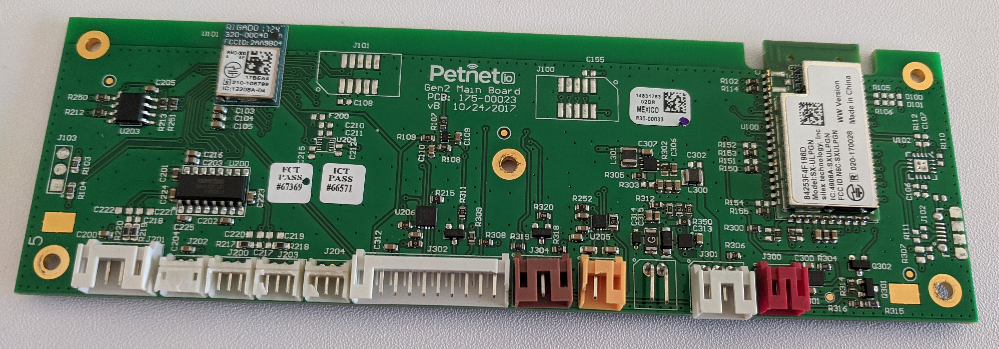
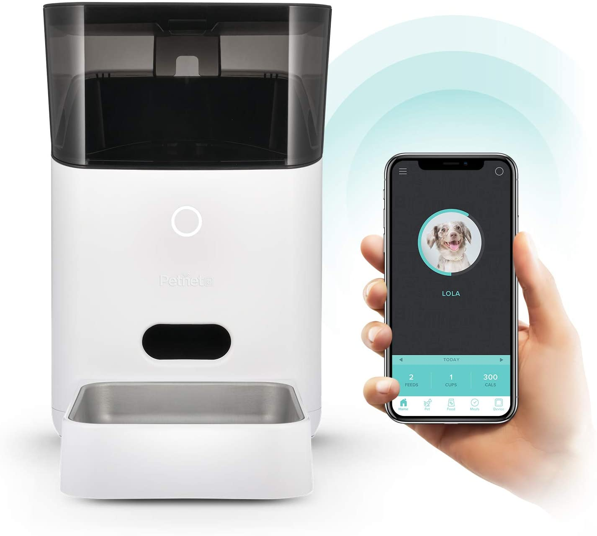
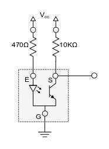
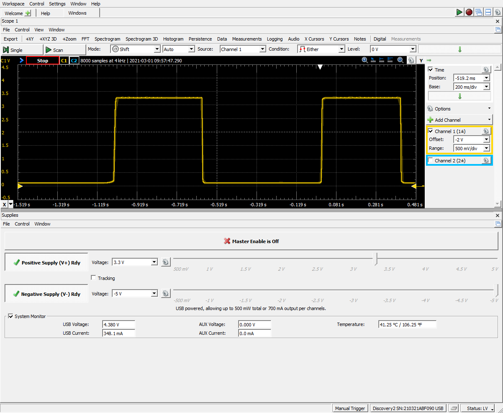
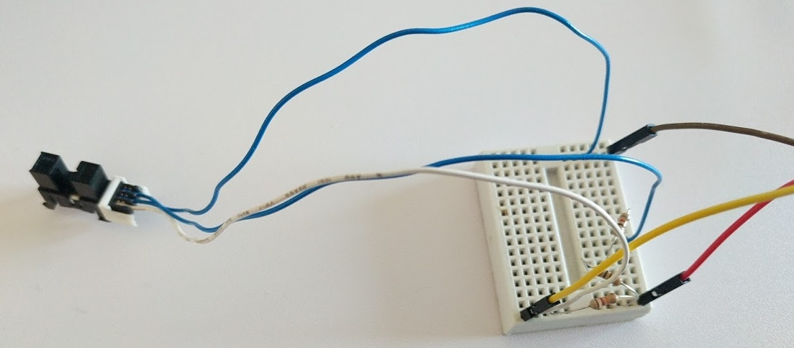
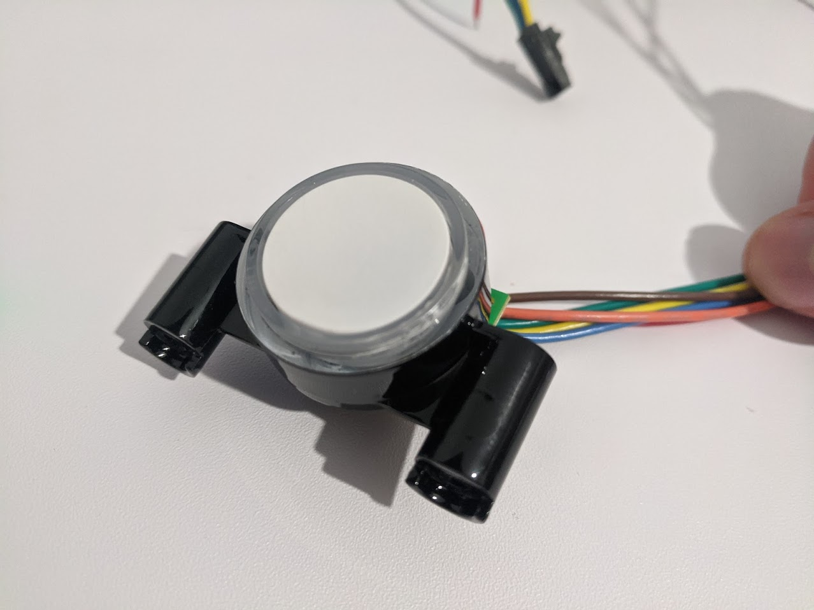

# PSoC 6 BLE PetNet Retrofit Smart FEEDER (WORK in Progress)  
\

This code implements a custom bluetooth GATT profile to control the machine remotely via Bluetooth

Designed with the - [PSoC 6 BLE Prototyping Kit](https://www.cypress.com/CY8CPROTO-063-BLE) (`CY8CPROTO-063-BLE`)
 and mostly using the Cypress API's (RTC is very weird with the API so for that one I have used the hal)

A bit about the PETnet CAT feeder.
this machine was designed to squeeze the users, all the software was built around a subscription model and the moment you stopped paying or the company went bust the machines just stopped working
started this project as a challenge to get it working again (to help a friend) and at the same time train on PSOC6.

also the PCB seemed to me a bit overkill (3 MCUs ?) for what the machine does, so hoping to minimize the footprint with the integrated hardware blocks in PSOC.

## Tools

- [ModusToolbox® software](https://www.cypress.com/products/modustoolbox-software-environment) v2.2
- PETNET Smart Feeder 2 
- [PSoC® 6 MCU](http://www.cypress.com/PSoC6) parts with Bluetooth LE connectivity
- [Digilent Analog Discovery 2](https://store.digilentinc.com/analog-discovery-2-100msps-usb-oscilloscope-logic-analyzer-and-variable-power-supply/) Amazing desktop hardware debugging tool

## Hardware Setup

First of all I had to start the hacking of the machine so will detail that process here

** Motor Encoder - Photo Interrupt sensor **

I actually burned the sensor before doing this (luckily I had an equivalent scrapped sensor from an old printer)
the schematic is important the diode polarity can be ID with a multimeter and then the remaining pin is the signal one.

This signal will be measured by a TCPWM Counter block 
the number of counts/pulses (Food dispensed) will be available to modify through the BLE interface
once that count is reached the counter will signal a kill/stop interrupt to the TCPWM PWM block controling the motor   

** RGB LED and button **

The UI for the machine is basically this RGB led ring and the push button, the LEDs are wired in common Anode, and also got them to run at a decent brightness at 3,3V, the button is just a switch signal

Color 	| Signal 	|PSoC Pin
 ------ |:---------:| -----: 
BR		|	SW sign	|Pin	
R		|SW C		|		
O		|VCC+LED	|100ohm -VCC
Y		|Red LED 	|6.3
G		|Green LED	|7.1
B		|Blue LED	|	
BLK		|Sensor1	|	
BL		|Sensor2	|	
Y		|Sensor2	|	

## Software Setup

